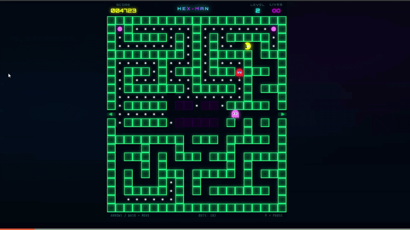

# Hexman-Offline-Game

Hexman is a browser-based arcade game inspired by the classic Pac-Man.  
The player controls Hexman through a maze, collecting dots while avoiding ghosts.  
Power pellets allow Hexman to temporarily defeat ghosts.

This game is built entirely with **HTML5 Canvas, CSS, and Vanilla JavaScript** and works offline in the browser.

## Live Demo

## Gameplay Preview

## Features

- Classic Pac-Man style gameplay
- 10 different maze levels
- Ghost AI with unique behavior
- Power pellets and ghost-eating mode
- Particle effects and animations
- Dynamic sound effects (Web Audio API)
- Mobile-friendly controls
- Pause and resume functionality
- Score tracking and lives system

## Game State Flow

menu → frozen → countdown → playing

playing →
   dying → gameover
   levelcomplete → next level → frozen
   paused → resume → playing

'''
menu → frozen → countdown → playing → dying / levelcomplete / paused
                                  ↓              ↓
                              gameover      next level (back to frozen)
                              

'''

## Controls

Keyboard:

- ↑ Move Up
- ↓ Move Down
- ← Move Left
- → Move Right
- P Pause / Resume
- Enter Start Game

Mobile:

- On-screen D-pad buttons

## Maze Legend

| Symbol | Meaning |
|------|------|
| # | Wall |
| . | Dot |
| o | Power Pellet |
| G | Ghost House |
| T | Tunnel |
| P | Player Spawn |

## Level of Mazes

## Tech Stack

- HTML5 Canvas
- CSS3 (Neon UI design)
- Vanilla JavaScript
- Web Audio API

## Project Structure

HEXMAN-OFFLINE-GAME
- index.html
- HEX-MAN.css
- HEX-MAN.js
- assets/
   - sounds/
- images/
- README.md

'''
HEXMAN-OFFLINE-GAME/
│
├── index.html
├── HEX-MAN.css
├── HEX-MAN.js
├── assets/
│   ├── sounds
│   └── images
└── README.md

'''

# Hexman Offline Game

